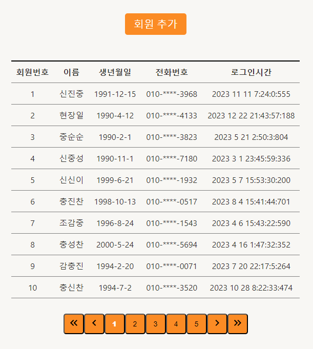
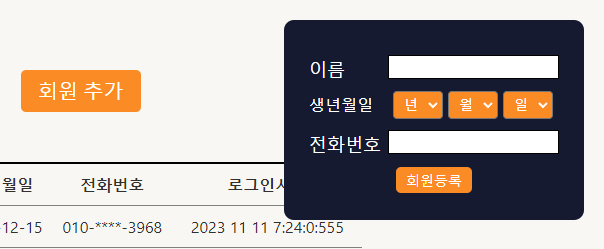
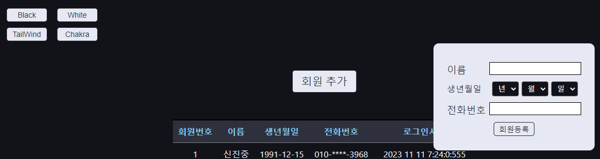
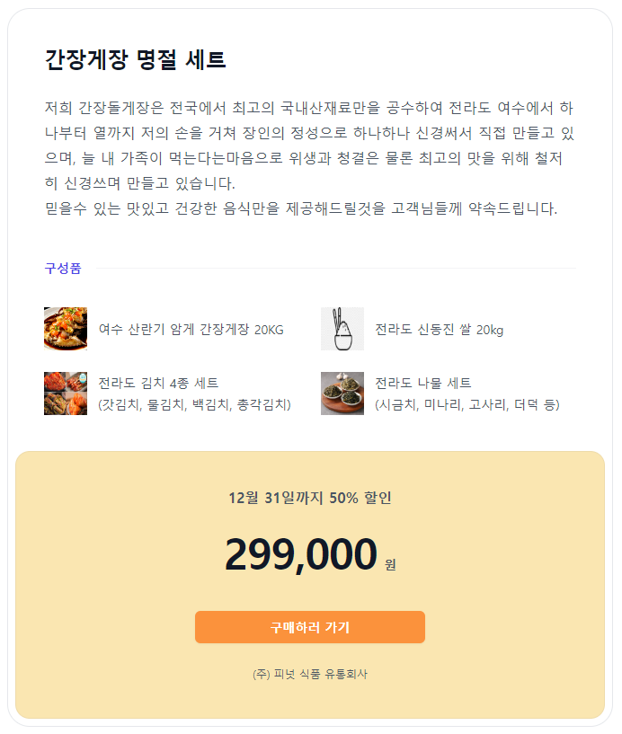
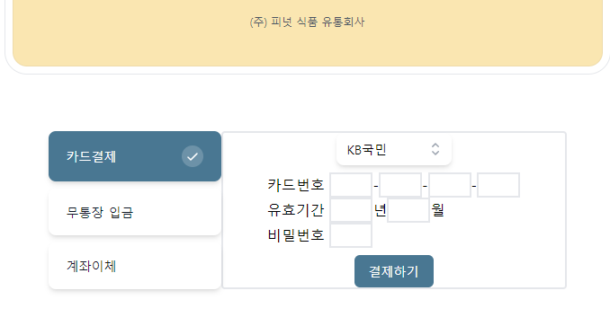
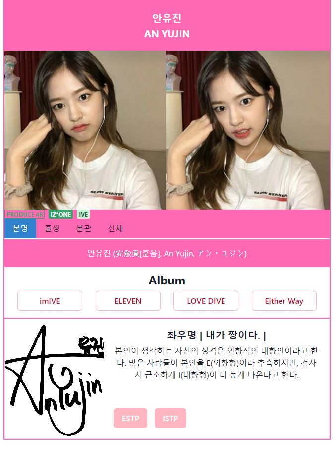

# Member

### Pair-1 - Noel , Jack

### 공용 컴포넌트

button, checkbox, input, modal, select, pagenation

# Develop Date

### Develop: 2023.12.13 ~ 2023.12.20

| Date  | Content                                                    |
| ----- | ---------------------------------------------------------- |
| 12/13 | 공용 컴포넌트 제작(button, checkbox, input, modal, select) |
| 12/14 | 스토리북 설치,사용                                         |
| 12/15 | 스토리북 사용                                              |
| 12/16 | 휴식                                                       |
| 12/17 | 휴식                                                       |
| 12/18 | 공용 컴포넌트 제작(pagenation), 스토리북 적용              |
| 12/19 | tailwind, tailwind CSS, headless CSS 사용                  |
| 12/20 | emotion, chakra CSS 사용                                   |

 

# 페이지 구성

#### 공용 컴포넌트 페이지, storybook, MUI icon

블랙모드

#### tailwind
tailwind UI + headless UI  

#### emotion
emotion + chakra UI  

# UI 라이브러리

### 1. MUI

아이콘을 자주 가져와서 사용하다보니까 사용하는데 큰 무리없이 사용했습니다.
단지 MUI icon은 chakra UI와 같이 사용이 가능하지만 @mui/material 파트의 MUI의 ui 부분이 전부 사용이 불가능해서 오류를 파악하는데 오래걸렸어서 사용을 못했습니다.

### 2. Chakra UI

공식문서의 정리가 잘되어 있어서 사용하기 좋은 라이브러리였습니다.
다른 UI라이브러리와 같이 사용하긴 힘들거같은 부분은 router부분을 chakraProvider로 감싸기 때문에 오류가 발생합니다.

### 3. TailwindCSS UI + Heaedless UI

headless ui가 tailwind CSS와 같이 사용하기 위해서 만들어졌기에 호환성 좋게 사용할 수 있었습니다.
tailwind가 기본적으로 제공하는 components와 templates도 편리한 사용성과 다양한 툴을 제공해주었습니다.
그 외에도 hero icons 등 연관지어 다양하게 사용하기 좋은 툴이 많았습니다.

# 회고

Noel -

Jack - 평소에 자주 사용하던 styled-components외에도 storybook과 여러 라이브러리를 사용해보면서 어떤식으로 사용하는지 그리고 어떤식으로 활용할 수 있는지 처음에는 생소했지만 적용해보고 나서는 각 라이브러리의 장단점을 어느정도 알게 되어서 다른 프로젝트 중에 필요하면 다양하게 사용해볼 수 있을거 같습니다.
